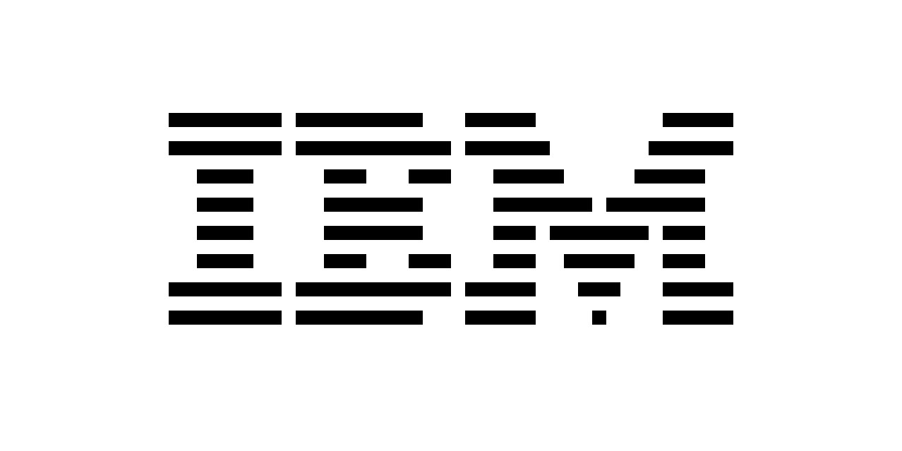

<!-- https://github.com/othneildrew/Best-README-Template -->

 
 <!--
 
-->

<!-- PROJECT LOGO -->
 

  

<h3 align="center">Chip8Emulator</h3>

  

    Welcome to my (feature incomplete) Chip8 Emulator!
     

> [!WARNING]  
> While this emulator can play many Chip8 titles, some issues have been noticed.
> If you find an error, feel free to send a pull request!

<!-- TABLE OF CONTENTS -->
# Links
* [About The Project](#about-the-project)
* [Built With](#built-with)
* [Installation](#installation)
* [Contributing](#contributing)
  * [Development Environment](#development-environment)
* [License](#license)
* [Contact](#contact)
* [Acknowledgements](#acknowledgements)

<!-- ABOUT THE PROJECT -->
# About The Project

This is a simple Chip8 Emualtor written in .NET 9.0 with C#. All Chip8 instructions have been implemented. This project uses [Raylib](https://github.com/raylib-cs/raylib-cs) for its simple graphics API.

(<a href="#readme-top">back to top</a>)

## Built With

(<a href="#readme-top">back to top</a>)

<!-- GETTING STARTED -->
# Installation

1. Clone the repository: `git clone https://github.com/m-GDEV/Chip8Emulator`
2. Install dotnet 9 (varies by OS)
3. Build & Run the project: `dotnet run`

(<a href="#readme-top">back to top</a>)

<!-- CONTRIBUTING -->
# Contributing

Contributions are what make the open source community such an amazing place to learn, inspire, and create. Any contributions you make are **greatly appreciated**.

If you have a suggestion that would make this better, please fork the repo and create a pull request. You can also simply open an issue with the tag "enhancement".
Don't forget to give the project a star! Thanks again!

1. Fork the Project on Github
2. Create your Feature Branch (`git checkout -b feature/AmazingFeature`)
3. Commit your Changes (`git commit -m 'Add some AmazingFeature'`)
4. Push to the Branch (`git push origin feature/AmazingFeature`)
5. Open a Pull Request on Github

(<a href="#readme-top">back to top</a>)

## Top contributors:

<!-- LICENSE -->
# License

Distributed under the GPL 3.0 License. See `LICENSE.txt` for more information.

(<a href="#readme-top">back to top</a>)

<!-- CONTACT -->
# Contact

Musa Ahmed - [musaa.ahmed7@gmail.com](mailto:musaa.ahmed7@gmail.com)

Project Link: [https://github.com/m-GDEV/Chip8Emulator](https://github.com/m-GDEV/Chip8Emulator)

(<a href="#readme-top">back to top</a>)

<!-- ACKNOWLEDGMENTS -->
# Acknowledgments

* [Best-README-Template: for this cool template](https://github.com/othneildrew/Best-README-Template)

(<a href="#readme-top">back to top</a>)

